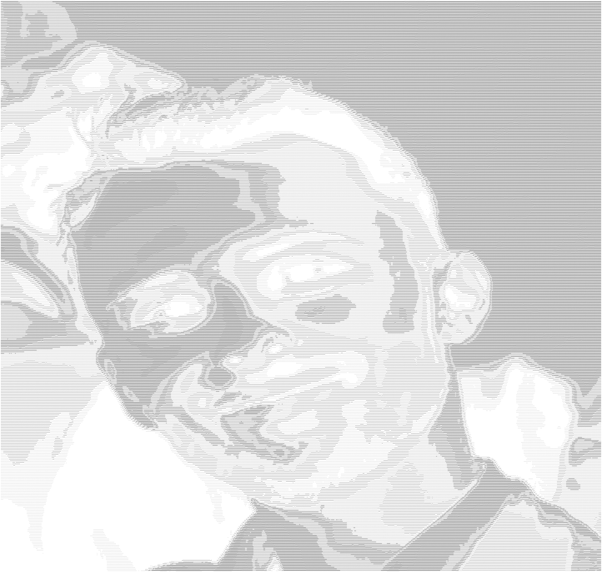

# asciiArtGenerator
My Ascii Art Generator implementation in go

<h2>What is Ascii Art?</h2>
Ascii Art is a way to represent an image with Ascii characters.

<h3>How I achieved it</h3>
I started working with the basic idea of calculating each pixel's RGB value and using the RBG -> Luma conversion formula for converting it to the corresponding Ascii character, mapped in order of "luminance".

I then tried to experiment with pre-filtering the image to get a better result for edges by using first the Sobel filter (which wasn't enough alone), and then both the Difference of Gaussians + the Sobel filter. To this day this method still hasn't been fine tuned, but one day I might come round and eventually get the hang of it!

<h3>Results</h3>

